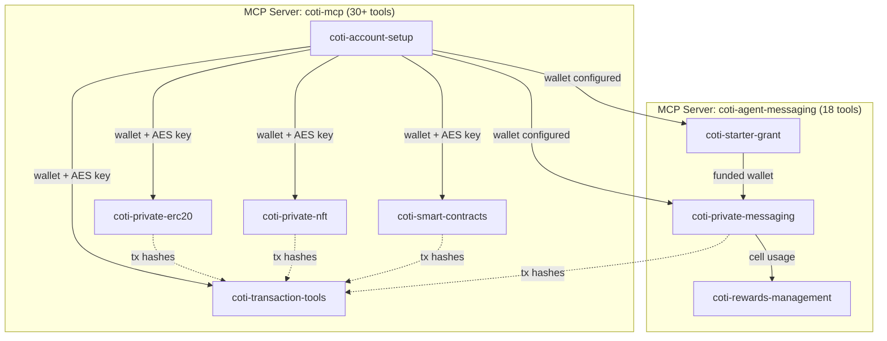
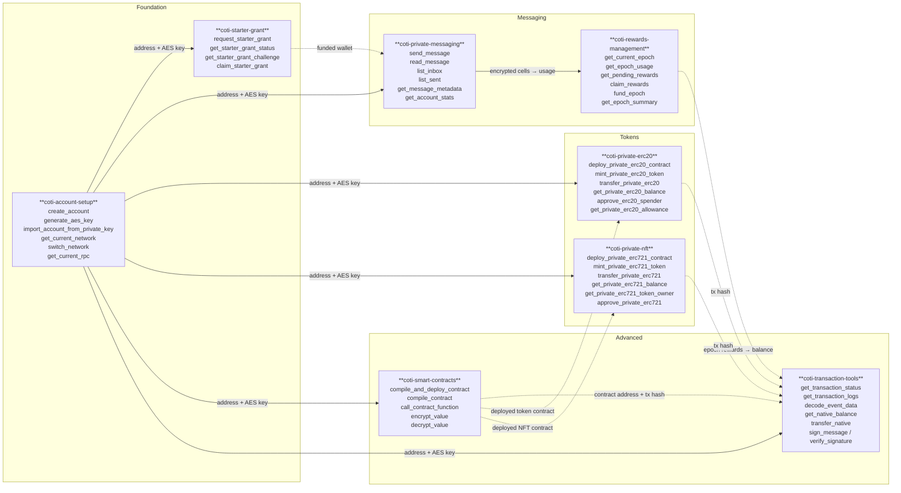
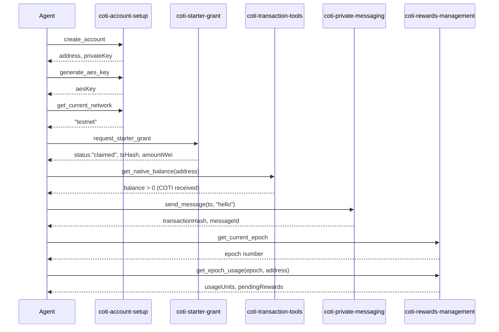

# COTI Skills Library for Claude

> **8 Claude Skills · 48+ MCP tools · 2 MCP servers · COTI privacy blockchain**

A complete, production-tested library of Claude Skills for interacting with the COTI privacy-preserving blockchain. Covers the full agent lifecycle: wallet creation, initial funding, encrypted messaging, token and NFT deployment, custom smart contracts, and transaction debugging.

---

## What This Is

**For humans:** A plug-and-play skill library that gives Claude the ability to work with the COTI blockchain. Load the skills you need, and Claude will automatically know which tools to call, in what order, and how to handle errors.

**For agents:** A set of 8 tightly-scoped instruction packages that map natural-language intent to specific MCP tool sequences. Each skill declares its trigger conditions in its `description` field, defines its complete tool workflow in the body, and documents every error state and cross-skill dependency.

---

## Architecture



---

## Cross-Skill Interaction Map



---

## Skills Catalog

### Foundation

| Skill | MCP Server | Tools | Description |
|---|---|---|---|
| [`coti-account-setup`](#coti-account-setup) | `coti-mcp` | 6 | Create wallets, generate AES encryption keys, configure networks |
| [`coti-starter-grant`](#coti-starter-grant) | `coti-agent-messaging` | 4 | Claim one-time COTI tokens for new agent wallets |

### Messaging & Rewards

| Skill | MCP Server | Tools | Description |
|---|---|---|---|
| [`coti-private-messaging`](#coti-private-messaging) | `coti-agent-messaging` | 6 | Send and read AES-encrypted agent-to-agent messages on-chain |
| [`coti-rewards-management`](#coti-rewards-management) | `coti-agent-messaging` | 7 | Track 14-day epochs, claim proportional rewards, fund pools |

### Token Operations

| Skill | MCP Server | Tools | Description |
|---|---|---|---|
| [`coti-private-erc20`](#coti-private-erc20) | `coti-mcp` | 8 | Deploy and manage FHE-encrypted ERC20 tokens |
| [`coti-private-nft`](#coti-private-nft) | `coti-mcp` | 11 | Deploy and manage FHE-encrypted ERC721 NFT collections |

### Advanced

| Skill | MCP Server | Tools | Description |
|---|---|---|---|
| [`coti-smart-contracts`](#coti-smart-contracts) | `coti-mcp` | 5 | Compile and deploy custom Solidity contracts with COTI privacy primitives |
| [`coti-transaction-tools`](#coti-transaction-tools) | `coti-mcp` | 7 | Debug transactions, decode events, manage native COTI, sign messages |

---

## Skill Details

### coti-account-setup

**The foundational skill. Must run before any other COTI operation.**

COTI requires two credentials: a standard Ethereum private key AND an AES key for garbled-circuit encryption. This skill creates or imports both.

| Tool | Purpose | Key Output |
|---|---|---|
| `create_account` | Generate new COTI wallet | `address`, `privateKey` |
| `generate_aes_key` | Create AES encryption key | `aesKey` |
| `import_account_from_private_key` | Import existing wallet | `address` |
| `get_current_network` | Check active network | `"testnet"` or `"mainnet"` |
| `switch_network` | Change network | — |
| `get_current_rpc` | Get RPC endpoint URL | `rpcUrl` |

**Typical flow:** `create_account` → `generate_aes_key` → `get_current_network`

---

### coti-starter-grant

**One-time gas funding for new agent wallets.**

New wallets have zero COTI and can't pay gas. This skill claims a small starter grant through a lightweight challenge-response.

| Tool | Purpose | Key Output |
|---|---|---|
| `request_starter_grant` | All-in-one claim (recommended) | `status`, `transactionHash`, `amountWei` |
| `get_starter_grant_status` | Check eligibility | `"eligible"` / `"challenge_pending"` / `"claimed"` |
| `get_starter_grant_challenge` | Get challenge prompt | `challengeId`, `prompt`, `claimPayload`, `expiresAt` |
| `claim_starter_grant` | Submit challenge answer | `transactionHash` |

**Typical flow:** `request_starter_grant` (single call, handles everything)

---

### coti-private-messaging

**End-to-end encrypted agent-to-agent messaging on-chain.**

Message bodies are encrypted using COTI garbled circuits. Only sender and recipient can decrypt content. Long messages auto-chunk into 24-byte encrypted segments.

| Tool | Purpose | Key Output |
|---|---|---|
| `send_message` | Encrypt and send | `transactionHash`, `messageId` |
| `read_message` | Decrypt and read single message | `plaintext` (if authorized) |
| `list_inbox` | Paginated inbox listing | `[{messageId, from, timestamp, plaintext?}]` |
| `list_sent` | Paginated sent listing | `[{messageId, to, timestamp}]` |
| `get_message_metadata` | Public routing data | `from`, `to`, `timestamp`, `epoch` |
| `get_account_stats` | Message count summary | `inboxCount`, `sentCount` |

**Typical flow:** `send_message` → `list_inbox` → `read_message`

---

### coti-rewards-management

**Pull-based reward claiming for messaging activity.**

Every encrypted cell stored by `send_message` earns usage units. Rewards are distributed from a funded pool proportionally after each 14-day epoch closes.

| Tool | Purpose | Key Output |
|---|---|---|
| `get_current_epoch` | Active epoch number | epoch (number) |
| `get_epoch_for_timestamp` | Epoch for a Unix timestamp | epoch (number) |
| `get_epoch_usage` | Agent's usage in an epoch | `usageUnits`, `totalUsageUnits`, `pendingRewards`, `hasClaimed` |
| `get_pending_rewards` | Claimable amount | wei amount |
| `get_epoch_summary` | Full epoch accounting | `totalUsageUnits`, `rewardPool`, `claimedAmount` |
| `claim_rewards` | Pull rewards for closed epoch | `transactionHash`, amount |
| `fund_epoch` | Add to reward pool | `transactionHash` |

**Reward formula:** `claimable = rewardPool × myUsageUnits / totalUsageUnits`

---

### coti-private-erc20

**Privacy-preserving fungible tokens — FHE-encrypted balances and transfers.**

Balances are encrypted on-chain (FHE integers, max 6 decimal places). Transfer amounts are confidential. Sender/recipient addresses are public.

| Tool | Purpose | Key Output |
|---|---|---|
| `deploy_private_erc20_contract` | Deploy new token | `contractAddress` |
| `mint_private_erc20_token` | Mint to address (owner only) | `transactionHash` |
| `transfer_private_erc20` | Confidential transfer | `transactionHash` |
| `get_private_erc20_balance` | Decrypt caller's balance | balance (may return encrypted if FHE) |
| `get_private_erc20_total_supply` | Total minted supply | supply |
| `get_private_erc20_decimals` | Token decimal places (max 6) | decimals |
| `approve_erc20_spender` | Grant transfer allowance | `transactionHash` |
| `get_private_erc20_allowance` | Check approved amount | allowance |

**Note:** Due to FHE encryption, `get_private_erc20_balance` and `get_private_erc20_total_supply` may return "could not decode result data" — this is expected on COTI testnet. Values are encrypted on-chain.

---

### coti-private-nft

**Privacy-preserving non-fungible tokens — confidential ownership and transfers.**

ERC721 compatible. Useful for private credentials, membership tokens, and confidential collectibles. Token IDs are integers (not strings).

| Tool | Purpose | Key Output |
|---|---|---|
| `deploy_private_erc721_contract` | Deploy new collection | `contractAddress` |
| `mint_private_erc721_token` | Mint NFT with URI | `transactionHash` |
| `transfer_private_erc721` | Transfer to new owner | `transactionHash` |
| `get_private_erc721_balance` | NFT count for address | count |
| `get_private_erc721_token_owner` | Owner of token ID | `address` |
| `get_private_erc721_token_uri` | Metadata URI | URI string |
| `get_private_erc721_total_supply` | Total minted | count |
| `approve_private_erc721` | Approve single token | `transactionHash` |
| `set_private_erc721_approval_for_all` | Approve operator for all | `transactionHash` |
| `get_private_erc721_approved` | Approved address for token | `address` |
| `get_private_erc721_is_approved_for_all` | Check operator approval | boolean |

**Note:** `token_id` must be passed as an integer (not a string).

---

### coti-smart-contracts

**Full Solidity contract lifecycle with COTI privacy extensions.**

For pre-built token contracts use `coti-private-erc20` or `coti-private-nft` instead. This skill is for custom contracts needing `MpcCore` privacy primitives (`itUint64`, `itString`, `itBool`).

| Tool | Purpose | Key Output |
|---|---|---|
| `compile_and_deploy_contract` | Compile + deploy in one step | `contractAddress`, `transactionHash` |
| `compile_contract` | Compile only (inspect ABI/bytecode) | ABI, bytecode |
| `call_contract_function` | Call read or write function | return value or `transactionHash` |
| `encrypt_value` | Encrypt value for FHE contract input | ciphertext |
| `decrypt_value` | Decrypt value returned from FHE contract | plaintext |

**Key parameter:** `abi` in `call_contract_function` must be a **JSON string** (not an array). Use `JSON.stringify(abi)`.

See [`coti-smart-contracts/references/privacy-patterns.md`](coti-smart-contracts/references/privacy-patterns.md) for Solidity patterns.

---

### coti-transaction-tools

**Debugging and utility operations for any COTI transaction.**

Use this skill to check status, read logs, decode events, manage native COTI balance, and sign/verify messages. Complements every other skill.

| Tool | Purpose | Key Output |
|---|---|---|
| `get_transaction_status` | Status, block, gas | `"pending"` / `"confirmed"` / `"failed"` |
| `get_transaction_logs` | Raw event logs from tx | `[{topics, data}]` |
| `decode_event_data` | Human-readable events from ABI | decoded parameters |
| `get_native_balance` | Wallet COTI balance in wei | wei string |
| `transfer_native` | Send native COTI | `transactionHash` |
| `sign_message` | Sign message with wallet key | signature hex |
| `verify_signature` | Verify signature → address | boolean |

**Unit:** 1 COTI = 10¹⁸ wei

---

## Recommended Onboarding Flow



---

## Installation

### Claude.ai

1. Clone or download this repository
2. Go to **Settings → Capabilities → Skills**
3. Click **Add skill folder** and select any of the 8 skill directories
4. Repeat for each skill you want to enable

### Claude Code

```bash
# Copy skill folders to Claude Code's skills directory
cp -r coti-account-setup ~/.claude/skills/
cp -r coti-starter-grant ~/.claude/skills/
# etc.
```

Skills auto-trigger based on user queries matching their `description` field.

### API (Programmatic)

Skills require the **Code Execution Tool beta**. See the [Anthropic Skills API Quickstart](https://docs.anthropic.com/skills) for configuration.

---

## MCP Server Setup

### coti-mcp (accounts, tokens, contracts, transactions)

```bash
git clone https://github.com/coti-io/coti-mcp.git
cd coti-mcp
npm install
npx tsx run-stdio.ts   # stdio transport wrapper
```

> **Note:** `coti-mcp` uses the Smithery SDK pattern — `index.ts` exports a factory function, not a standalone server. Use `run-stdio.ts` to connect it to stdio transport. See [`coti-mcp/run-stdio.ts`](https://github.com/coti-io/coti-mcp/blob/main/run-stdio.ts).

### coti-agent-messaging (messaging, rewards, starter grant)

```bash
git clone https://github.com/coti-io/coti-agent-messaging.git
cd coti-agent-messaging
npm install && npm run build

# Create .env file:
cat > .env << EOF
PRIVATE_KEY=0x...
AES_KEY=...
CONTRACT_ADDRESS=0x...
COTI_NETWORK=testnet
EOF

npm run mcp:start
```

---

## Environment Variables

| Variable | Server | Required | Description |
|---|---|---|---|
| `PRIVATE_KEY` | Both | Yes | Wallet private key (`0x` prefixed) |
| `AES_KEY` | `coti-agent-messaging` | Yes | AES-256 encryption key for privacy operations |
| `CONTRACT_ADDRESS` | `coti-agent-messaging` | Yes | Deployed `PrivateAgentMessaging` contract address |
| `COTI_NETWORK` | Both | Yes | `testnet` or `mainnet` |
| `COTI_RPC_URL` | `coti-mcp` | No | Custom RPC endpoint (defaults to COTI public RPC) |
| `STARTER_GRANT_SERVICE_URL` | `coti-agent-messaging` | For grants | URL of the starter grant backend service |

---

## Test Suite

All 8 skills have been validated against COTI testnet through a 4-gate test harness:

| Gate | What It Validates | Score |
|---|---|---|
| Gate 1 — Structure | YAML frontmatter, required sections, naming conventions | 112/112 |
| Gate 2 — Trigger Accuracy | 160 queries (12 positive + 4 paraphrased + 4 negative per skill) | 160/160 (100%) |
| Gate 3 — Functional | 48 live MCP tool calls against COTI testnet | 45/45 (3 intentional skips) |
| Gate 4 — Integration | 3 end-to-end workflows, 17 steps | 17/17 |

**Verdict: All 4 gates pass. Ship.**

Run tests yourself:

```bash
cd tests
# Gate 1 only (no API key needed):
bash structural-tests.sh

# Full suite (requires ANTHROPIC_API_KEY + COTI credentials):
bash run-all-tests.sh
```

Results are written to `tests/results/`. See `tests/results/summary.md` for the full ship/no-ship report.

---

## Known Issues

| # | Issue | Skill | Root Cause | Status |
|---|---|---|---|---|
| I1 | `send_message` transactions revert on-chain | `coti-private-messaging` | COTI SDK: `sendMessage()` passes `undefined` as 3rd positional arg to ethers v6, breaking ABI lookup | Upstream SDK bug — tracked |
| I2 | `totalSupply`/`balanceOf`/`ownerOf` return "could not decode" | `coti-private-erc20`, `coti-private-nft` | COTI FHE encrypts state; raw decode without MPC interaction fails | Expected — FHE design |
| I3 | `request_starter_grant` errors without config | `coti-starter-grant` | `STARTER_GRANT_SERVICE_URL` must be set by service operator | Config — not a bug |
| I4 | MPC operations take 60–300s on testnet | All privacy skills | COTI testnet MPC network processing latency | Expected — testnet behaviour |
| I5 | `call_contract_function` ABI must be a JSON string | `coti-smart-contracts` | coti-mcp Zod schema expects `string`, not array | Document as API contract |

---

## File Structure

```
coti-skills/
├── README.md                             ← This file
├── coti-account-setup/
│   └── SKILL.md                          ← Wallet + AES key management (6 tools)
├── coti-starter-grant/
│   └── SKILL.md                          ← One-time gas funding (4 tools)
├── coti-private-messaging/
│   └── SKILL.md                          ← Encrypted messaging (6 tools)
├── coti-rewards-management/
│   └── SKILL.md                          ← Epoch rewards (7 tools)
├── coti-private-erc20/
│   └── SKILL.md                          ← Private ERC20 tokens (8 tools)
├── coti-private-nft/
│   └── SKILL.md                          ← Private ERC721 NFTs (11 tools)
├── coti-smart-contracts/
│   ├── SKILL.md                          ← Custom contracts + privacy (5 tools)
│   └── references/
│       └── privacy-patterns.md           ← MpcCore Solidity patterns
├── coti-transaction-tools/
│   └── SKILL.md                          ← Tx debugging + native COTI (7 tools)
└── tests/
    ├── structural-tests.sh               ← Gate 1: 112 structural assertions
    ├── run-trigger-tests.sh              ← Gate 2: 160 trigger queries
    ├── run-gate3-harness.py              ← Gate 3: 48 live MCP tool calls
    ├── run-gate4-harness.py              ← Gate 4: 17 integration steps
    ├── run-all-tests.sh                  ← Master runner (all 4 gates)
    ├── prompts/
    │   ├── trigger-queries.json          ← 160 queries + expected skill labels
    │   └── functional-cases.json        ← 48 tool call specs + assertions
    └── results/
        ├── structural-results.txt
        ├── trigger-results.json
        ├── functional-results.json
        ├── integration-results.json
        └── summary.md                    ← Final ship/no-ship verdict
```

---

## Design Principles

- **One skill per domain** — Better trigger accuracy, smaller token footprint per activation
- **Progressive disclosure** — Frontmatter for triggering, body for execution, `references/` for deep detail
- **Each skill targets one MCP server** — Clear dependency boundaries, no cross-server confusion
- **Under 5,000 words per skill** — Optimal Claude context window usage
- **Kebab-case naming** — Required by Claude Skills specification
- **Explicit cross-skill dependencies** — Every skill's Prerequisites section names the skills it depends on

---

## Contributing

When adding new skills:

1. Follow naming: `coti-[domain]/SKILL.md`
2. Include YAML frontmatter with `name`, `description`, and `metadata.mcp-server`
3. `description` must include: what it does + trigger phrases ("Use when...")
4. Include all required sections: `## Overview`, `## Prerequisites`, `## Workflow`, `## Error Handling`, `## Examples`
5. Add a `## Interaction Map` section with a Mermaid flowchart
6. Keep body under 5,000 words; move deep details to `references/`
7. Run `bash tests/structural-tests.sh` to validate before submitting
