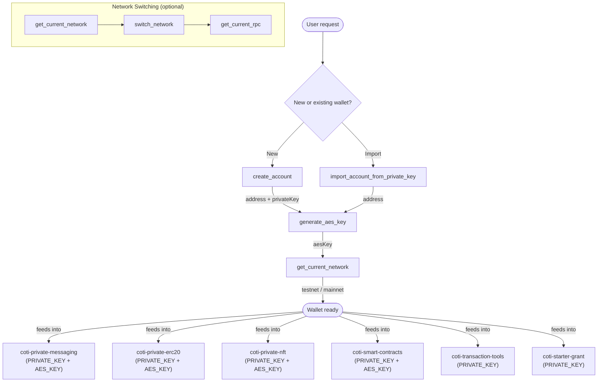

# COTI Account Setup

## Overview

This skill handles wallet account creation and configuration on the COTI privacy-preserving Layer 2 network. It is the **foundational skill** that must run before any other COTI operation (messaging, tokens, contracts).

COTI accounts require two credentials:
- A **private key** — standard Ethereum-compatible key for signing transactions
- An **AES key** — encryption key for COTI's garbled-circuit (FHE) privacy operations

Both are required for full COTI functionality.

## Prerequisites

- The `coti-mcp` MCP server must be connected and running
- No prior account is needed — this skill creates one from scratch

## Workflow

### Creating a New Account

1. Call `create_account` to generate a fresh COTI wallet
2. Call `generate_aes_key` to create the AES encryption key (requires a funded wallet on testnet)
3. Verify the network with `get_current_network`
4. Store both keys securely — they are required by all downstream COTI skills

### Importing an Existing Account

1. Call `import_account_from_private_key` with the user's existing private key
2. Call `generate_aes_key` if an AES key is not already available
3. Verify the network with `get_current_network`

### Switching Networks

1. Call `get_current_network` to check which network is active
2. Call `switch_network` with `"testnet"` or `"mainnet"`
3. Confirm the switch with `get_current_rpc` to verify the RPC endpoint changed

## Interaction Map

### Data Flow

| Tool | Inputs | Outputs | Used By |
|---|---|---|---|
| `create_account` | none | `address`, `privateKey` | All other skills |
| `generate_aes_key` | implicit: configured wallet | `aesKey` | Messaging, ERC20, NFT, contracts |
| `import_account_from_private_key` | `private_key` | `address` | All other skills |
| `get_current_network` | none | `"testnet"` or `"mainnet"` | coti-starter-grant (testnet required) |
| `switch_network` | `network` | confirmation | — |
| `get_current_rpc` | none | `rpcUrl` | Debugging |

## Tool Reference

### `create_account`
Creates a new COTI wallet. Returns the wallet address and private key. **The private key is shown only once — store it immediately.**

### `generate_aes_key`
Generates an AES-256 encryption key for the current wallet. Required for all privacy operations: encrypted messaging, private token transfers, and confidential smart contracts. On testnet, the wallet must have a small COTI balance before this call succeeds.

### `import_account_from_private_key`
Imports an existing wallet using a `0x`-prefixed 64-character hex private key string.

### `get_current_network`
Returns `"testnet"` or `"mainnet"`.

### `switch_network`
Switches the active network. Takes a `network` parameter: `"testnet"` or `"mainnet"`.

### `get_current_rpc`
Returns the current RPC endpoint URL. Useful for verifying network switches and debugging connectivity.

## Error Handling

- **"Missing AES key"**: `generate_aes_key` was not called. Run it before any privacy operation.
- **"Invalid private key"**: Key passed to `import_account_from_private_key` is malformed. Must start with `0x` and be 64 hex characters (66 total).
- **"Account not funded"**: `generate_aes_key` requires a small COTI balance on testnet. Use `coti-starter-grant` to get initial tokens.
- **Network timeout**: Check RPC endpoint with `get_current_rpc`. If using a custom RPC, verify it is reachable.

## Examples

**New agent setup:**
> "Set up a new COTI wallet on testnet"

1. `create_account` → returns address + private key
2. `generate_aes_key` → returns AES key
3. `get_current_network` → confirm testnet

**Import existing wallet:**
> "Import my existing COTI wallet with private key 0xabc..."

1. `import_account_from_private_key` with `private_key: "0xabc..."`
2. `generate_aes_key` → returns AES key
3. `get_current_network` → confirm network

**Switch to mainnet:**
> "Switch my COTI wallet to mainnet"

1. `switch_network` with `network: "mainnet"`
2. `get_current_rpc` → confirm mainnet RPC URL

## Important Notes

- **Store both keys securely.** Never log or expose them.
- The AES key and private key are separate. Both are required for COTI FHE privacy features.
- Testnet is recommended for development. Switch to mainnet only for production.
- After account setup, the wallet is ready for all other COTI skills: messaging, tokens, NFTs, contracts, and transactions.
- `generate_aes_key` binds the AES key to the wallet address on-chain on COTI testnet — it is not a purely local operation.
