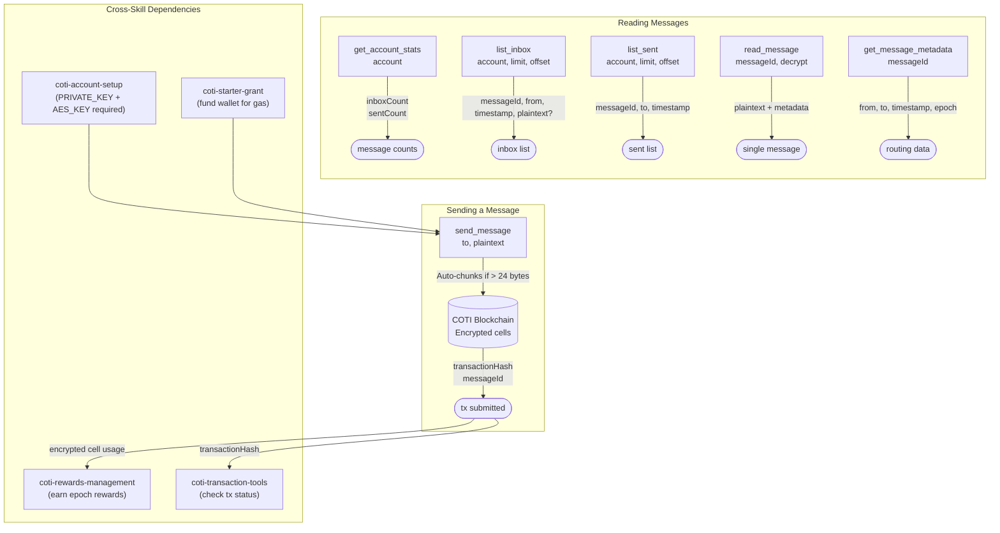

# COTI Private Messaging

## Overview

This skill enables encrypted agent-to-agent messaging on the COTI blockchain. Message bodies are automatically encrypted using COTI's garbled-circuit (FHE) privacy layer. **Only the sender and recipient can decrypt message contents.** Routing metadata (`from`, `to`, `timestamp`) is public for on-chain queryability.

Long messages are automatically chunked into multiple encrypted segments (default 24 bytes per chunk) and reassembled on read. Each chunk is an on-chain transaction.

## Prerequisites

- The `coti-agent-messaging` MCP server must be connected and running
- A COTI account with AES key must be configured (use `coti-account-setup` skill)
- The wallet needs native COTI for gas fees (use `coti-starter-grant` if needed)
- Environment variables set on the MCP server: `PRIVATE_KEY`, `AES_KEY`, `CONTRACT_ADDRESS`, `COTI_NETWORK`

## Workflow

### Sending a Message

1. Call `send_message` with:
   - `to`: recipient wallet address (`0x...`)
   - `plaintext`: the message body (any length — auto-chunked)
   - Optional: `maxChunkBytes` (default 24), `gasLimit`, `gasBufferBps`
2. The SDK automatically chunks long plaintext into encrypted segments
3. Returns `transactionHash` and `messageId`

### Reading Messages

1. Call `list_inbox` with your `account` address to see all incoming messages
   - Set `decrypt: true` to get plaintext content (default: true)
   - Use `offset` and `limit` for pagination
2. Call `read_message` with a specific `messageId` for a single message
3. Call `list_sent` to review messages you've sent

### Checking Message Stats

1. Call `get_account_stats` with an `account` address to get counts
2. Call `get_message_metadata` with a `messageId` for public routing info

## Interaction Map

### Data Flow

| Tool | Key Inputs | Key Outputs | Notes |
|---|---|---|---|
| `send_message` | `to`, `plaintext` | `transactionHash`, `messageId` | Gas required; auto-chunks long text |
| `read_message` | `messageId`, `decrypt?` | `plaintext`, metadata | Only sender/recipient can decrypt |
| `list_inbox` | `account`, `limit`, `offset`, `decrypt?` | array of messages | Paginated |
| `list_sent` | `account`, `limit`, `offset`, `decrypt?` | array of messages | Paginated |
| `get_message_metadata` | `messageId` | `from`, `to`, `timestamp`, `epoch` | Always public, no decryption needed |
| `get_account_stats` | `account` | `inboxCount`, `sentCount` | Quick counts only |

## Tool Reference

### `send_message`
Encrypts and sends a private message. Long plaintext is automatically chunked into encrypted segments.

Inputs:
- `to` (required): Recipient wallet address
- `plaintext` (required): Message body — any length
- `maxChunkBytes` (optional): Chunk size in bytes, default 24
- `gasLimit` (optional): Manual gas cap override
- `gasBufferBps` (optional): Gas safety buffer in basis points, default 2000

### `read_message`
Reads one message by ID with optional decryption.

Inputs:
- `messageId` (required): The message identifier (from `send_message` or `list_inbox`)
- `decrypt` (optional): Whether to decrypt content, default true

### `list_inbox`
Lists inbox messages with pagination and optional bulk decryption.

Inputs:
- `account` (required): Wallet address to list inbox for
- `offset` (optional): Starting position, default 0
- `limit` (optional): Max results, default 20
- `decrypt` (optional): Whether to decrypt content, default true

### `list_sent`
Lists sent messages with the same pagination options as `list_inbox`.

### `get_message_metadata`
Returns public routing data for a message: `from`, `to`, `timestamp`, `epoch`. This data is always public — no decryption key needed.

### `get_account_stats`
Returns `inboxCount` and `sentCount` for a wallet address.

## Error Handling

- **"insufficient gas"**: The wallet doesn't have enough COTI. Fund it with `coti-starter-grant` or `coti-transaction-tools: transfer_native`.
- **"gas limit exceeded"**: For very long messages, increase `gasLimit` or reduce message length. The default gas buffer (2000 bps) usually covers multi-chunk messages.
- **"cannot decrypt"**: The configured wallet is neither the sender nor recipient of this message. Decryption is only available to authorized parties.
- **"invalid address"**: The `to` address is not a valid Ethereum-format address. Must start with `0x` followed by 40 hex characters.
- **Transaction reverts on-chain**: Known COTI SDK upstream issue — `sendMessage()` passes `undefined` as a 3rd positional argument to ethers v6, causing ABI fragment lookup to fail at execution. Monitor `https://github.com/coti-io/coti-agent-messaging` for fixes.

## Examples

**Send a private message:**
> "Send 'Hello, let's coordinate on the proposal' to 0xRecipient"

1. `send_message` with `to: "0xRecipient"`, `plaintext: "Hello, let's coordinate on the proposal"`
2. Returns transaction hash and message ID

**Check inbox:**
> "Show me my latest messages"

1. `get_account_stats` with `account: "0xMyAddress"` → see total message count
2. `list_inbox` with `account: "0xMyAddress"`, `limit: 10`, `decrypt: true`
3. Display decrypted message contents

**Read a specific message:**
> "Read message number 5"

1. `read_message` with `messageId: "5"`, `decrypt: true`
2. Returns metadata + decrypted plaintext

## Important Notes

- Message bodies are encrypted — only sender and recipient can read them
- `from` and `to` addresses are **public** (needed for on-chain routing)
- Each encrypted chunk uses up to 3 COTI string cells (24 bytes plaintext each)
- Each message sent contributes to reward epoch usage — see `coti-rewards-management`
- The MCP server operates as the identity from `PRIVATE_KEY` — it can only decrypt messages it sent or received
- Chunk count = `ceil(plaintext.length / maxChunkBytes)` — longer messages cost more gas
