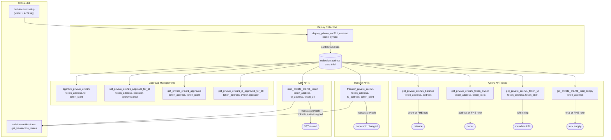

# COTI Private NFTs (ERC721)

## Overview

This skill deploys and manages privacy-preserving ERC721 NFTs on COTI. Private NFTs use garbled circuits to add confidentiality to ownership and transfer operations while maintaining full EVM compatibility.

Use cases include:
- **Private collectibles** — ownership visible only to authorized parties
- **Confidential credentials** — membership or access tokens without public disclosure
- **Private proof-of-ownership** — claim rights without revealing identity

## Prerequisites

- The `coti-mcp` MCP server must be connected and running
- A COTI account with AES key must be configured (use `coti-account-setup` skill)
- Native COTI balance for gas fees

## Workflow

### Deploying an NFT Collection

1. Call `deploy_private_erc721_contract` with:
   - `name`: Collection name (e.g., `"PrivateArt"`)
   - `symbol`: Collection symbol (e.g., `"PART"`)
2. Save the returned contract address for all subsequent operations

### Minting NFTs

1. Call `mint_private_erc721_token` with:
   - `token_address`: The deployed collection contract
   - `to_address`: Recipient wallet address
   - `token_uri`: Metadata URI (typically IPFS, e.g., `"ipfs://Qm..."`)
2. Token IDs are auto-assigned sequentially starting from 0

### Transferring NFTs

1. Call `transfer_private_erc721` with:
   - `token_address`: The collection contract address
   - `to_address`: New owner wallet
   - `token_id`: The specific NFT to transfer (integer, not string)

### Querying NFT Data

| What you want | Tool | Key input |
|---|---|---|
| How many NFTs an address holds | `get_private_erc721_balance` | `token_address`, `address` |
| Who owns a specific token | `get_private_erc721_token_owner` | `token_address`, `token_id` |
| Metadata URI for a token | `get_private_erc721_token_uri` | `token_address`, `token_id` |
| Total minted supply | `get_private_erc721_total_supply` | `token_address` |

### Managing Approvals

| What you want | Tool |
|---|---|
| Approve one token for transfer | `approve_private_erc721` |
| Approve operator for all tokens | `set_private_erc721_approval_for_all` |
| Check who is approved for a token | `get_private_erc721_approved` |
| Check if operator is approved for all | `get_private_erc721_is_approved_for_all` |

## Interaction Map

### Data Flow

| Tool | Key Inputs | Key Outputs | Notes |
|---|---|---|---|
| `deploy_private_erc721_contract` | `name`, `symbol` | `contractAddress` | Deployer becomes owner |
| `mint_private_erc721_token` | `token_address`, `to_address`, `token_uri` | `transactionHash` | token_id auto-assigned |
| `transfer_private_erc721` | `token_address`, `to_address`, `token_id` (int) | `transactionHash` | token_id must be integer |
| `get_private_erc721_balance` | `token_address`, `address` | count | FHE may return encrypted bytes |
| `get_private_erc721_token_owner` | `token_address`, `token_id` (int) | address | FHE may return encrypted bytes |
| `get_private_erc721_token_uri` | `token_address`, `token_id` (int) | URI string | Plain string, not encrypted |
| `get_private_erc721_total_supply` | `token_address` | count | FHE may return encrypted bytes |
| `approve_private_erc721` | `token_address`, `to`, `token_id` (int) | `transactionHash` | Single token approval |
| `set_private_erc721_approval_for_all` | `token_address`, `operator`, `approved` (bool) | `transactionHash` | Operator approval |
| `get_private_erc721_approved` | `token_address`, `token_id` (int) | address | — |
| `get_private_erc721_is_approved_for_all` | `token_address`, `owner`, `operator` | boolean | — |

## Tool Reference

### `deploy_private_erc721_contract`
Deploys a new private ERC721 collection. Returns the contract address. The deployer becomes the owner and can mint tokens.

### `mint_private_erc721_token`
Mints a new NFT to a specified address with a token URI. Token IDs are assigned automatically starting from 0.

### `transfer_private_erc721`
Transfers an NFT to a new owner. The caller must be the current owner or an approved operator.

### `get_private_erc721_balance`
Returns the number of NFTs held by an address. Due to COTI FHE encryption, may return encrypted bytes — this is expected behavior.

### `get_private_erc721_token_owner`
Returns the current owner address of a specific token ID.

### `get_private_erc721_token_uri`
Returns the metadata URI associated with a token (e.g., `"ipfs://Qm..."`). This value is not encrypted.

### `get_private_erc721_total_supply`
Returns the total number of minted tokens in the collection. FHE-encrypted on-chain — may return a decode note.

### `approve_private_erc721`
Approves another address to transfer a specific token. Only the token owner can call this.

### `set_private_erc721_approval_for_all`
Grants or revokes operator status for ALL of the caller's tokens in one call (standard ERC721 operator pattern).

### `get_private_erc721_approved`
Returns the currently approved address for a specific token ID.

### `get_private_erc721_is_approved_for_all`
Returns a boolean indicating whether an operator is approved for all tokens of a given owner.

## Error Handling

- **"not owner or approved"**: The caller is not the token owner and has not been approved to transfer it. Call `approve_private_erc721` or `set_private_erc721_approval_for_all` first.
- **"token does not exist"**: The token ID has not been minted. Check with `get_private_erc721_total_supply` to see the current count.
- **"not authorized to mint"**: Only the contract owner (deployer) can mint. Verify you are using the same wallet that deployed the collection.
- **"could not decode result data"**: Expected behavior for FHE state reads (`balance`, `owner`, `totalSupply`). Values are encrypted on-chain — the tool is working correctly.

## Examples

**Deploy a private NFT collection:**
> "Create a private NFT collection called SecretArt with symbol SART"

1. `deploy_private_erc721_contract` with `name: "SecretArt"`, `symbol: "SART"`
2. Save the returned contract address

**Mint an NFT:**
> "Mint an NFT to my wallet with metadata at ipfs://Qm..."

1. `mint_private_erc721_token` with `token_address: "0x..."`, `to_address: "0xMyWallet"`, `token_uri: "ipfs://Qm..."`
2. Returns transaction hash; token ID starts at 0

**Check ownership:**
> "Who owns token number 3?"

1. `get_private_erc721_token_owner` with `token_address: "0x..."`, `token_id: 3`

**Transfer an NFT:**
> "Send token 2 to 0xRecipient"

1. `transfer_private_erc721` with `token_address: "0x..."`, `to_address: "0xRecipient"`, `token_id: 2`

## Important Notes

- **`token_id` must be an integer** (not a string). Pass `3` not `"3"`.
- Parameter names use `token_address` (not `contractAddress`) and `to_address` (not `to`) — exact spelling matters for the MCP tool schema.
- Token URIs typically point to IPFS or other decentralized storage for metadata JSON.
- Approval patterns follow standard ERC721 conventions — use single-token approval for specific delegations, operator approval for full delegations (e.g., a marketplace).
- FHE state reads (`balance`, `owner`, `totalSupply`) may return encrypted bytes on the COTI testnet — this is expected, not an error.
