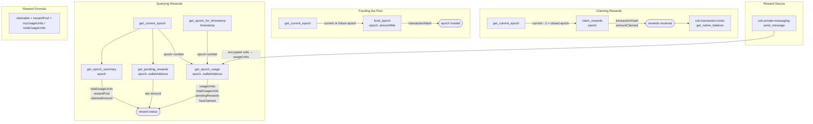

# COTI Rewards Management

## Overview

This skill manages the reward system tied to COTI private messaging. Rewards are funded in native COTI and distributed proportionally based on messaging activity within **14-day epochs**. Agents earn usage units proportional to the number of encrypted cells their messages generate. Rewards are claimed after an epoch closes.

The system is **pull-based**: no automation required. Agents call `claim_rewards` when they choose to.

## Prerequisites

- The `coti-agent-messaging` MCP server must be connected and running
- A COTI account must be configured with messaging activity in at least one epoch
- Native COTI balance is needed for `fund_epoch` operations

## Workflow

### Checking Reward Status

1. Call `get_current_epoch` to see which epoch is active
2. Call `get_epoch_usage` with a past epoch and the agent's wallet address
   - Returns: `usageUnits`, `totalUsageUnits`, `pendingRewards`, `hasClaimed`
3. Call `get_epoch_summary` for the full epoch picture: total usage, reward pool, claimed amounts

### Claiming Rewards

1. Call `get_current_epoch` to identify closed epochs (current − 1 and earlier)
2. Call `get_pending_rewards` with a closed epoch and the agent's wallet address
3. If the amount is greater than 0, call `claim_rewards` with that epoch
4. Returns the transaction hash and amount claimed

### Funding Epochs

1. Call `get_current_epoch` to get the current epoch number
2. Call `fund_epoch` with the target epoch and `amountWei` (in wei, 10¹⁸ per COTI)
   - You can fund the current epoch or pre-fund future epochs
   - Past epochs cannot be funded

## Interaction Map



### Data Flow

| Tool | Key Inputs | Key Outputs | Notes |
|---|---|---|---|
| `get_current_epoch` | none | epoch number | Base for all other epoch calls |
| `get_epoch_for_timestamp` | `timestamp` (Unix) | epoch number | Lookup historical epoch |
| `get_epoch_usage` | `epoch`, `walletAddress` | `usageUnits`, `totalUsageUnits`, `pendingRewards`, `hasClaimed` | Per-agent view |
| `get_pending_rewards` | `epoch`, `walletAddress` | wei amount | Quick claimable check |
| `get_epoch_summary` | `epoch` | `totalUsageUnits`, `rewardPool`, `claimedAmount`, `claimedUsageUnits` | Full epoch view |
| `claim_rewards` | `epoch` | `transactionHash`, amount | Epoch must be closed |
| `fund_epoch` | `epoch`, `amountWei` | `transactionHash` | Cannot fund past epochs |

## Tool Reference

### `get_current_epoch`
Returns the current 14-day reward epoch number (integer starting from 0).

### `get_epoch_for_timestamp`
Resolves which epoch contains a given Unix timestamp (seconds). Useful for looking up rewards from a specific date.

### `get_epoch_usage`
Returns an agent's usage data for a specific epoch:
- `usageUnits`: the caller's encrypted-cell contribution
- `totalUsageUnits`: total cells across all agents in this epoch
- `pendingRewards`: estimated claimable amount in wei
- `hasClaimed`: boolean, whether rewards were already claimed

### `get_pending_rewards`
Returns the claimable native-COTI amount in wei for a specific agent and epoch. Shortcut version of `get_epoch_usage` for quick balance checks.

### `get_epoch_summary`
Returns epoch-wide totals: total usage units, reward pool size, claimed amount, claimed usage units. Shows the full accounting picture.

### `claim_rewards`
Claims the configured wallet's rewards for a **closed** epoch. Returns transaction hash and amount claimed. Each wallet can claim once per epoch.

### `fund_epoch`
Sends native COTI to fund an epoch's reward pool. Can fund the current or a future epoch. Past epochs cannot receive new funding.

## Reward Formula

```
claimable = rewardPool × myUsageUnits / totalUsageUnits
```

- **Usage units** are counted by encrypted cell count, not by logical message count
- A single-chunk message contributes cells equal to its ciphertext length
- A multipart message contributes the sum of all chunk cell counts
- The last claimant in an epoch receives any rounding dust
- The entire funded pool is always distributed — no rewards are left stranded

## Error Handling

- **"epoch not closed"**: You can only claim rewards after an epoch has ended (14 days after it started). Call `get_current_epoch` and subtract 1 for the most recent closed epoch.
- **"already claimed"**: This wallet already claimed rewards for this epoch. One claim per wallet per epoch.
- **"no usage in epoch"**: The agent sent no messages during this epoch — no rewards to claim.
- **"cannot fund past epoch"**: The target epoch has already ended. Only the current epoch and future epochs can be funded.

## Examples

**Check my earnings:**
> "How much COTI have I earned from messaging?"

1. `get_current_epoch` → epoch 3
2. `get_epoch_usage` for epochs 0, 1, 2 with agent address
3. `get_pending_rewards` for any unclaimed closed epochs
4. Report: usage units, pending rewards, and claimed amounts per epoch

**Claim rewards:**
> "Claim my rewards for last epoch"

1. `get_current_epoch` → epoch 3
2. `get_pending_rewards` for epoch 2 → returns wei amount
3. `claim_rewards` for epoch 2 → returns tx hash and amount

**Fund the reward pool:**
> "Fund the current epoch with 1 COTI"

1. `get_current_epoch` → epoch 3
2. `fund_epoch` with `epoch: 3`, `amountWei: "1000000000000000000"`

## Important Notes

- Epochs are 14 days long, starting from the contract deployment timestamp
- Rewards are **pull-based** — agents must actively call `claim_rewards`. Nothing is automatic.
- Usage is weighted by encrypted cell count, incentivizing more and longer messaging
- Claim order can affect rounding: the last claimant gets the remainder (rounding dust)
- Use `get_epoch_for_timestamp` to look up which epoch a specific historical date belongs to
- `fund_epoch` can be called by anyone — anyone can add to the reward pool
