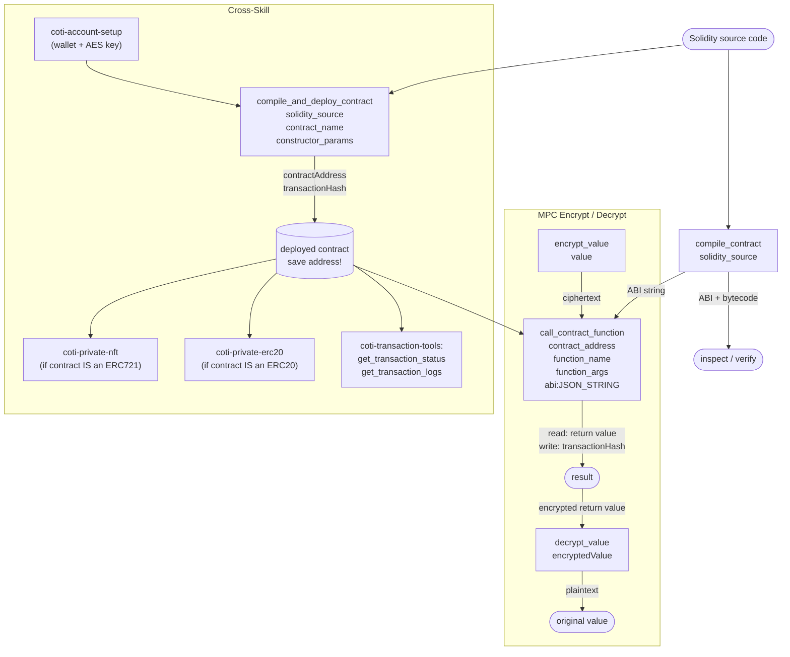

# COTI Smart Contracts

## Overview

This skill handles the full lifecycle of custom Solidity smart contracts on COTI: writing, compiling, deploying, and interacting. COTI extends standard Solidity with **privacy primitives powered by garbled circuits**, allowing developers to build confidential smart contracts using familiar tools.

For pre-built token contracts, use the `coti-private-erc20` or `coti-private-nft` skills instead. This skill is for **custom contracts** that need direct Solidity authoring or COTI-specific privacy types (`itUint64`, `itString`, `itBool`).

## Prerequisites

- The `coti-mcp` MCP server must be connected and running
- A COTI account with AES key must be configured (use `coti-account-setup` skill)
- Native COTI balance for deployment gas costs
- Solidity source code for the contract to deploy

## Workflow

### Compile and Deploy (recommended)

1. Write or provide Solidity source code
   - For privacy features, import `MpcCore` and use `itString`/`itUint64` types
2. Call `compile_and_deploy_contract` with:
   - `solidity_source`: The Solidity source code string
   - `contract_name`: The contract name to deploy (must match `contract Foo` in source)
   - `constructor_params`: Array of constructor arguments, or empty array `[]`
3. Returns the deployed contract address and transaction hash

### Compile Only (inspect before deploying)

1. Call `compile_contract` with `solidity_source`
2. Returns ABI and bytecode without deploying
3. Use the ABI later in `call_contract_function`

### Interact with Deployed Contracts

1. Call `call_contract_function` with:
   - `contract_address`: The deployed contract
   - `function_name`: The function to call (e.g., `"store"`, `"retrieve"`)
   - `function_args`: Array of arguments
   - `abi`: The contract ABI as a **JSON string** (use `JSON.stringify(abi)`)
2. Read-only functions return their value directly
3. Write functions return a transaction hash

### Encrypt and Decrypt Values for Privacy Contracts

1. Call `encrypt_value` to encrypt a value using the wallet's AES key
2. Pass the ciphertext as an argument to a privacy contract function
3. Call `decrypt_value` to decrypt a value returned from a privacy contract

## Interaction Map



### Data Flow

| Tool | Key Inputs | Key Outputs | Notes |
|---|---|---|---|
| `compile_contract` | `solidity_source` | ABI (text), bytecode | No deployment |
| `compile_and_deploy_contract` | `solidity_source`, `contract_name`, `constructor_params` | `contractAddress`, `transactionHash` | One-step |
| `call_contract_function` | `contract_address`, `function_name`, `function_args`, `abi` (JSON string!) | value or `transactionHash` | `abi` must be JSON string |
| `encrypt_value` | `value` | ciphertext | Uses wallet's AES key |
| `decrypt_value` | `encryptedValue` | plaintext | Uses wallet's AES key |

## Tool Reference

### `compile_and_deploy_contract`
Compiles Solidity source and deploys the named contract in one step. Returns the deployed address and transaction hash.

### `compile_contract`
Compiles Solidity source and returns ABI + bytecode without deploying. Useful for inspecting the ABI before deployment or for manual deployment workflows.

### `call_contract_function`
Calls a function on a deployed contract. Handles both read-only (`view`/`pure`) and state-changing functions.

**Critical:** The `abi` parameter must be a **JSON string**, not an array object.

```javascript
// CORRECT:
abi: JSON.stringify([{"name":"retrieve","type":"function",...}])

// WRONG:
abi: [{"name":"retrieve","type":"function",...}]
```

### `encrypt_value`
Encrypts a plaintext value (number or string) using the configured wallet's AES key. Returns ciphertext suitable for use as an `itUint64` or `itString` argument in a privacy contract.

### `decrypt_value`
Decrypts a garbled-circuit-encrypted value returned from a privacy contract call. Returns the original plaintext.

## Privacy Contract Patterns

COTI extends Solidity with privacy primitives. See [`references/privacy-patterns.md`](references/privacy-patterns.md) for full examples.

**Key types:**
- `itUint64` — encrypted unsigned 64-bit integer
- `itString` — encrypted string (chunked at 24 bytes)
- `itBool` — encrypted boolean

**Key library — `MpcCore`:**
```solidity
import "@coti-io/coti-contracts/contracts/utils/mpc/MpcCore.sol";

// Validate an encrypted input from a user
MpcCore.validateCiphertext(encryptedInput)

// Re-encrypt a stored value for a specific viewer
MpcCore.offboardToUser(storedEncrypted, viewerAddress)

// Make a value readable by anyone (public)
MpcCore.setPublic(value)
```

**Privacy state variable pattern:**
```solidity
mapping(address => itUint64) private _balances;

function setBalance(address user, itUint64 calldata encrypted) external {
    _balances[user] = MpcCore.validateCiphertext(encrypted);
}
```

## Error Handling

- **Compilation errors**: Check Solidity syntax and pragma version. COTI uses specific compiler versions (`^0.8.0` is safe).
- **"insufficient gas for deployment"**: Large contracts need more gas. Ensure adequate COTI balance before deploying.
- **"constructor args mismatch"**: The number or types of constructor arguments don't match. Verify the constructor signature in your Solidity source.
- **"function not found"**: The function name doesn't exist in the ABI. Check spelling and that you passed the correct ABI.
- **"Invalid arguments: abi — Expected string, received array"**: The `abi` parameter was passed as an array. It must be a JSON string.
- **"revert"**: The contract function reverted. Check `require`/`revert` conditions in the source code. Use `coti-transaction-tools: get_transaction_logs` to see emitted events.

## Examples

**Deploy a simple storage contract:**
> "Deploy a simple storage contract on COTI"

```solidity
// SPDX-License-Identifier: MIT
pragma solidity ^0.8.0;
contract SimpleStorage {
    uint256 private value;
    function store(uint256 v) public { value = v; }
    function retrieve() public view returns (uint256) { return value; }
}
```

1. `compile_and_deploy_contract` with `solidity_source` (above), `contract_name: "SimpleStorage"`, `constructor_params: []`
2. Returns deployed address

**Call a contract function:**
> "Read the stored value from my contract"

1. `call_contract_function` with:
   - `contract_address: "0x..."`,
   - `function_name: "retrieve"`,
   - `function_args: []`,
   - `abi: "{\"inputs\":[],\"name\":\"retrieve\",\"outputs\":[...],\"type\":\"function\"}"` (JSON string)

**Encrypt a value for a privacy contract:**
> "Encrypt the number 42 for my private contract"

1. `encrypt_value` with `value: "42"`
2. Returns encrypted ciphertext for use in contract call

## Important Notes

- COTI contracts are EVM-compatible with additional garbled-circuit privacy primitives (`MpcCore`)
- `abi` in `call_contract_function` **must be a JSON string** — the coti-mcp Zod schema enforces `string` type
- Privacy contract view functions may time out on testnet (60–180s) due to MPC network processing — this is expected
- Always test on testnet before deploying to mainnet
- For standard ERC20/ERC721 deployments, use `coti-private-erc20` and `coti-private-nft` skills — they handle the contract source and ABI automatically
- Deep Solidity privacy patterns: see `references/privacy-patterns.md`
