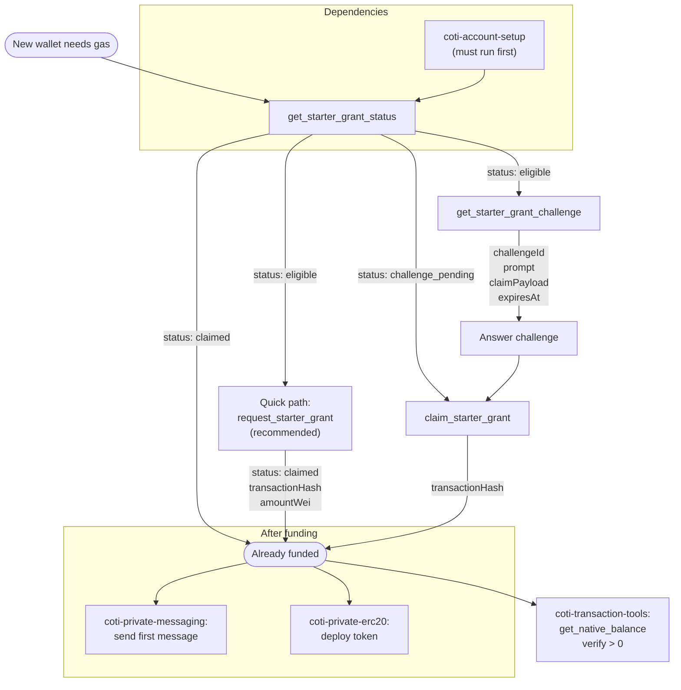

# COTI Starter Grant

## Overview

This skill handles the one-time starter COTI grant onboarding flow. New agent wallets start with zero COTI and cannot pay gas fees. The starter grant provides a small initial amount of native COTI through a lightweight challenge-response mechanism.

The grant is **wallet-bound**: each address can only claim once. After claiming, the wallet has enough COTI to send messages and pay gas for initial operations.

## Prerequisites

- The `coti-agent-messaging` MCP server must be connected and running
- A COTI account must already be configured (use `coti-account-setup` skill first)
- The `STARTER_GRANT_SERVICE_URL` environment variable must be set on the MCP server
- The wallet must not have previously claimed a starter grant

## Workflow

### Quick One-Call Flow (Recommended)

1. Call `request_starter_grant` — handles the entire challenge-request-claim cycle in a single call
2. Check the result for `status: "claimed"` and the `transactionHash`
3. Use `coti-transaction-tools: get_native_balance` to confirm the COTI was received

### Manual Step-by-Step Flow

1. Call `get_starter_grant_status` to check eligibility
   - `"eligible"` → proceed to step 2
   - `"challenge_pending"` → skip to step 3 with the existing challenge
   - `"claimed"` → already done, no action needed
2. Call `get_starter_grant_challenge` to receive a challenge prompt and claim payload
3. Answer the challenge prompt (it is intentionally trivial)
4. Call `claim_starter_grant` with the `challengeId`, `challengeAnswer`, and `claimPayload`

## Interaction Map



### Data Flow

| Tool | Inputs | Outputs | Notes |
|---|---|---|---|
| `get_starter_grant_status` | none (uses configured wallet) | `status` string | Check before claiming |
| `get_starter_grant_challenge` | none | `challengeId`, `prompt`, `claimPayload`, `expiresAt` | Prompt is trivial by design |
| `claim_starter_grant` | `challengeId`, `challengeAnswer`, `claimPayload` | `transactionHash` | Signs payload with wallet key |
| `request_starter_grant` | none | `status`, `walletAddress`, `transactionHash`, `amountWei` | Handles all 3 steps internally |

## Tool Reference

### `request_starter_grant`
All-in-one: requests a challenge, solves it, and claims the grant in one MCP call. This is the recommended path — it handles challenge generation, answer submission, and on-chain claim atomically.

Example result:
```json
{
  "status": "claimed",
  "walletAddress": "0x...",
  "transactionHash": "0x...",
  "amountWei": "25000000000000000000"
}
```

### `get_starter_grant_status`
Checks the current state of the starter grant for this wallet.

Possible statuses:
- `"eligible"` — no grant claimed, can request
- `"challenge_pending"` — a challenge was issued but not yet claimed (use existing `challengeId`)
- `"claimed"` — grant already received, no further action available

### `get_starter_grant_challenge`
Requests a new challenge from the backend service. Returns a `challengeId`, `prompt` (the question to answer), `claimPayload` (signed by the backend), and `expiresAt` timestamp.

### `claim_starter_grant`
Submits the solved challenge answer to the backend. The MCP server signs the `claimPayload` with the configured wallet before forwarding. Required inputs: `challengeId`, `challengeAnswer`, `claimPayload`.

## Error Handling

- **"already claimed"**: This wallet has already received a starter grant. One grant per wallet address — permanent, not resettable.
- **"challenge expired"**: The challenge timed out. Call `get_starter_grant_challenge` again for a fresh one.
- **"starter grant service unreachable"**: `STARTER_GRANT_SERVICE_URL` is not set or the service is not running. Verify the environment variable points to the running grant service.
- **"install ID mismatch"**: The local install state file may be corrupted. Check the path at `STARTER_GRANT_INSTALL_ID_PATH`.

## Examples

**New agent onboarding (recommended):**
> "I just created a COTI wallet, get me some starter tokens"

1. `request_starter_grant` → returns `status: "claimed"` with tx hash
2. Confirm wallet now has COTI for gas

**Check eligibility before claiming:**
> "Am I eligible for a COTI starter grant?"

1. `get_starter_grant_status` → returns eligibility status
2. If `"eligible"`, proceed with `request_starter_grant`

## Important Notes

- The starter grant is **one-time per wallet address**. Wallet deduplication is enforced on-chain — it cannot be worked around.
- The challenge prompt is intentionally lightweight. It is friction, not a serious anti-bot defense.
- The `installId` is a local soft deduplication signal stored on disk, not a trustless identity guarantee.
- After claiming, the wallet typically has enough COTI for ~50–100 transactions on testnet.
- Always run `coti-account-setup` before this skill — the wallet address must exist before claiming.
