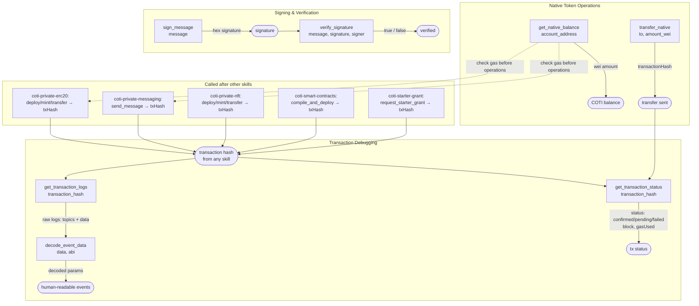

# COTI Transaction Tools

## Overview

This skill provides utility operations for monitoring on-chain activity, managing native COTI tokens, and cryptographic signing. It is the **go-to debugging and utility toolkit** that complements every other COTI skill.

Use it when:
- A transaction from any other skill returns a hash and you need to verify status
- You need to check native COTI balance before or after an operation
- You need to decode events from a completed transaction
- You need to sign or verify a message for authentication

## Prerequisites

- The `coti-mcp` MCP server must be connected and running
- A COTI account must be configured (use `coti-account-setup` skill)

## Workflow

### Checking Transaction Status

1. Call `get_transaction_status` with the `transaction_hash`
2. Returns: status (`pending`/`confirmed`/`failed`), block number, and gas used

### Reading and Decoding Transaction Logs

1. Call `get_transaction_logs` with the `transaction_hash`
2. Returns raw event logs (topics + data hex)
3. Call `decode_event_data` with the raw `data` and the contract ABI to get human-readable parameters

### Native COTI Balance

1. Call `get_native_balance` with the `account_address`
2. Returns the balance in wei (divide by 10¹⁸ for COTI)

### Transferring Native COTI

1. Call `transfer_native` with `to` (recipient) and `amount` (in wei)
2. Returns the transaction hash

### Signing and Verifying Messages

1. Call `sign_message` with the `message` string
2. Returns a hex signature
3. Call `verify_signature` with `message`, `signature`, and `signer` (expected address)
4. Returns boolean: true if the signature matches the signer

## Interaction Map

### Data Flow

| Tool | Key Inputs | Key Outputs | Notes |
|---|---|---|---|
| `get_transaction_status` | `transaction_hash` | `status`, `blockNumber`, `gasUsed` | Poll after any tx |
| `get_transaction_logs` | `transaction_hash` | `[{topics, data}]` | Raw, needs decoding |
| `decode_event_data` | `data`, `abi` | decoded event params | ABI must match the contract |
| `get_native_balance` | `account_address` | wei string | 1 COTI = 10¹⁸ wei |
| `transfer_native` | `to`, `amount` (wei) | `transactionHash` | — |
| `sign_message` | `message` | hex signature | Standard Ethereum personal sign |
| `verify_signature` | `message`, `signature`, `signer` | boolean | — |

## Tool Reference

### `get_transaction_status`
Returns confirmation status, block number, and gas used for a transaction hash.

Statuses:
- `"pending"` — not yet mined
- `"confirmed"` — mined and finalized (status = 1)
- `"failed"` — mined but reverted (status = 0)

### `get_transaction_logs`
Returns raw event logs emitted during a transaction. Each log has `topics` (event signature + indexed params) and `data` (non-indexed params, hex encoded).

### `decode_event_data`
Decodes raw hex event data using a provided ABI into human-readable parameter names and values. The ABI must match the contract that emitted the event.

### `get_native_balance`
Returns the native COTI balance for a wallet address in wei. To display in COTI: divide by 10¹⁸.

### `transfer_native`
Sends native COTI from the configured wallet to a recipient. Amount is in wei.

Examples:
- 0.5 COTI = `"500000000000000000"` wei
- 1 COTI = `"1000000000000000000"` wei

### `sign_message`
Signs a message string with the configured wallet's private key using the standard Ethereum personal sign format (`\x19Ethereum Signed Message:\n...`). Returns a hex signature.

### `verify_signature`
Verifies that a given signature was produced by a specific wallet address for a specific message. Returns `true` or `false`.

## Error Handling

- **"transaction not found"**: The hash doesn't exist on the current network. Verify the hash and check you're on the right network (testnet vs mainnet).
- **"insufficient balance"**: Not enough native COTI for the transfer. Call `get_native_balance` first to check.
- **"invalid signature"**: The signature doesn't match the expected signer address. The message, signature, or address may be incorrect.
- **"ABI decode error"**: The provided ABI doesn't match the event data. Ensure you're using the correct contract ABI — events from contract A cannot be decoded with contract B's ABI.

## Examples

**Check if a transaction succeeded:**
> "Did my transaction 0xabc123... go through?"

1. `get_transaction_status` with `transaction_hash: "0xabc123..."`
2. Returns `status: "confirmed"` or `"failed"` with block number

**Check COTI balance:**
> "How much COTI do I have?"

1. `get_native_balance` with `account_address: "0xMyWallet"`
2. Divide result by 10¹⁸ for human-readable COTI amount

**Transfer native COTI:**
> "Send 0.5 COTI to 0xRecipient"

1. `transfer_native` with `to: "0xRecipient"`, `amount: "500000000000000000"`
2. Returns transaction hash

**Debug a failed transaction:**
> "Why did transaction 0xdef456... fail?"

1. `get_transaction_status` → confirms it failed (status 0)
2. `get_transaction_logs` → returns emitted events before revert
3. `decode_event_data` with the contract ABI → read any error events

**Sign a message for authentication:**
> "Sign the message 'I authorize this action' with my wallet"

1. `sign_message` with `message: "I authorize this action"`
2. Returns hex signature

**Verify someone's signature:**
> "Verify that 0xSender actually signed this message"

1. `verify_signature` with `message`, `signature`, `signer: "0xSender"`
2. Returns `true` if authentic

## Important Notes

- **All native COTI amounts are in wei**: 1 COTI = 10¹⁸ wei = `"1000000000000000000"`
- Transaction status may take a few seconds to update after submission — `"pending"` is normal immediately after broadcast
- Message signing uses standard Ethereum personal sign format — compatible with MetaMask, ethers.js, and viem
- This skill is a utility layer — it does not have its own state. It reads and verifies data from other skills' transactions.
- For token-specific operations (ERC20/ERC721), use the dedicated skills instead of `decode_event_data` manually
